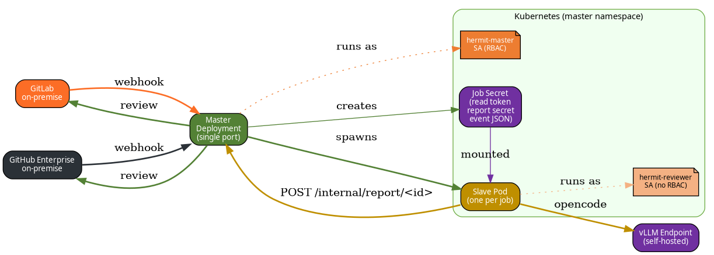

# H.E.R.M.I.T


**Hermit Emits Reviews for Merge-requests In Total-isolation**

H.E.R.M.I.T is a configurable code-review bot designed to work with **on-premise GitLab and GitHub instances**. It reviews pull requests (PR) and merge requests (MR) by running the **opencode** agent against a dedicated, self-hosted **vLLM** model endpoint.

It is built to run fully **airgapped**: no external SaaS, no cloud services, no model inference outside your network.

**Primary repository:** [gitlab.com/hermit-bot/hermit](https://gitlab.com/hermit-bot/hermit)  
**Mirror:** [github.com/hermit-pr/hermit](https://github.com/hermit-pr/hermit)

## Features

- **Webhook-driven** — listens on GitLab/GitHub webhooks and automatically publishes a review on every PR/MR the webhook is configured for.
- **On-demand reviews** — commenting `@hermit` on a PR/MR also triggers a review.
- **On-premise friendly** — works with self-hosted GitLab and GitHub instances, including **fork** pull requests and cross-project GitLab merge requests.
- **Horizontally scalable** — durable job state + deterministic job ids let you run multiple masters and restart them freely.
- **Powered by opencode** — review logic is driven by the opencode agent.
- **Self-hosted inference** — reviews are generated by a dedicated vLLM endpoint serving your own model.
- **Airgapped** — fully self-contained; no data leaves your network.
- **Never merges or commits** — its only write action is posting a review comment.

## Why H.E.R.M.I.T vs Official OpenCode Integrations?

While OpenCode provides official GitHub Actions and GitLab CI components, they are designed for standard, cloud-based workflows. H.E.R.M.I.T is built specifically to solve Enterprise IT and strict security constraints:

- **CI-Agnostic (No Runners needed):** If your enterprise uses Jenkins, Bamboo, or TeamCity, you cannot use the official GitHub/GitLab runner integrations. H.E.R.M.I.T operates entirely outside your CI pipeline by intercepting webhooks and spawning its own pods.
- **Centralized Management:** The official integrations require you to commit a `.github/workflows/opencode.yml` or `.gitlab-ci.yml` file into every single repository. H.E.R.M.I.T operates via a single Organization/Group-level webhook. You deploy and update the bot in one place for your entire company.
- **True Air-Gap & Private PKI:** The official actions struggle when talking to on-premise Git instances or local vLLM endpoints signed by corporate Certificate Authorities. H.E.R.M.I.T natively supports injecting your private root CAs (`HERMIT_CA_BUNDLE_PATH`) to ensure all internal HTTPS traffic is trusted.
- **Zero-Trust Isolation:** Running AI-generated code inside your standard CI runners can expose production secrets or Docker sockets. H.E.R.M.I.T sandboxes the AI in an ephemeral, unprivileged Kubernetes Pod (UID 1000, read-only root filesystem, capabilities dropped), completely segregated from your actual build environment.

## Architecture

H.E.R.M.I.T has two roles running the same container image:

| Role | Entrypoint | Deployment | Responsibility |
| --- | --- | --- | --- |
| **master** | `python -m hermit.main` | long-running Deployment | receive webhooks, validate them, spawn one reviewer pod per change, collect the review, submit it to the PR/MR |
| **slave** (reviewer pod) | `python -m hermit.slave` | one-shot Pod, one per review | clone the repository, compute the diff, run opencode against vLLM, report the review back to the master |



*Data flow: webhook → master → slave pod → vLLM → report → master → review posted.*

## How it works

1. A webhook is configured on your on-premise GitLab or GitHub instance, pointing at the master.
2. When a PR/MR event (or a comment mentioning `@hermit`) is received, the master validates it against the configured secret.
3. The master spawns a one-shot reviewer pod in Kubernetes and waits for its report.
4. The pod clones the repository, diffs base against head, and reviews the diff with opencode against your vLLM endpoint.
5. The pod reports the review back to the master over `/internal/report/<job_id>` (authenticated with a per-job secret).
6. The master publishes the review on the PR/MR and cleans up the pod.

## Prerequisites

- An on-premise GitLab or GitHub instance with webhooks enabled.
- A vLLM instance serving the model you want to use for reviews.
- The opencode agent available to the pods.
- A Kubernetes cluster to run the master and reviewer pods.

## Configuration

### Master

The master is configured through environment variables prefixed with `HERMIT_` (a `.env` file is also supported). Secrets are handled as `SecretStr` and never logged.

| Variable | Required | Description |
| --- | --- | --- |
| `HERMIT_GIT_PROVIDER` | yes | `github` or `gitlab` |
| `HERMIT_GIT_HOST_URL` | yes | URL of your on-premise GitLab/GitHub instance. For **GitHub Enterprise** this must include `/api/v3` (e.g. `https://ghe.corp/api/v3`); for **self-hosted GitLab** include `/api/v4` (e.g. `https://gitlab.corp/api/v4`). Git clone operations automatically strip the API path. |
| `HERMIT_GITHUB_TOKEN` | for GitHub | write token used to post reviews |
| `HERMIT_GITLAB_TOKEN` | for GitLab | write token used to post reviews |
| `HERMIT_GIT_READ_TOKEN` | yes | read-only token handed to reviewer pods for cloning |
| `HERMIT_WEBHOOK_SECRET` | yes | secret used to validate inbound webhooks (must be at least 16 characters) |
| `HERMIT_JOB_ID_SIGNING_KEY` | no | key used to derive deterministic, horizontally-shared job ids (defaults to the webhook secret) |
| `HERMIT_VLLM_ENDPOINT` | yes | URL of the dedicated vLLM inference endpoint |
| `HERMIT_MODEL` | yes | name of the model served by the vLLM endpoint |
| `HERMIT_VLLM_API_KEY` | no | optional API key forwarded to the vLLM endpoint |
| `HERMIT_REVIEW_RULES` | no | extra output instructions appended to the bot's hardcoded default review rules (never replaces the internal operating prompt) |
| `HERMIT_TRIGGER_TAGS` | no | JSON list of comment triggers (case-insensitive match against comment body); any match spawns a review (default `["@hermit", "/recheck"]`) |
| `HERMIT_POLICY_FILE_PATH` | no | project policy file extracted from the base commit (default `AGENTS.md`) |
| `HERMIT_OPENCODE_BIN` | no | path to the opencode binary (default `opencode`) |
| `HERMIT_OPENCODE_INIT_IMAGE` | no | init container image providing opencode binary (default `ghcr.io/anomalyco/opencode:latest`; empty to disable) |
| `HERMIT_OPENCODE_INIT_BIN_PATH` | no | path to opencode binary inside init image (default `/usr/local/bin/opencode`) |
| `HERMIT_WORKSPACE` | no | working directory opencode runs in (default `/workspace`) |
| `HERMIT_MASTER_URL` | yes | URL reviewer pods use to reach `/internal/report` |
| `HERMIT_POD_IMAGE` | yes | container image for reviewer pods |
| `HERMIT_POD_NAMESPACE` | no | namespace for pods/secrets (default: in-cluster namespace) |
| `HERMIT_POD_SERVICE_ACCOUNT` | no | ServiceAccount for reviewer pods |
| `HERMIT_REPORT_TIMEOUT_SECONDS` | no | max wait for a review before failing the job (default 1800) |
| `HERMIT_ABANDONED_JOB_TIMEOUT_SECONDS` | no | max age of an orphaned job Secret before sweep deletes it (default 3600) |
| `HERMIT_OPENCODE_TIMEOUT_SECONDS` | no | max runtime for the opencode subprocess inside the reviewer pod (default 900) |
| `HERMIT_MAX_CONCURRENT_JOBS` | no | max reviewer pods a single replica may have in flight at once (default 20) |
| `HERMIT_RATE_LIMIT_PER_IP` | no | max requests per source IP per window (default 60) |
| `HERMIT_RATE_LIMIT_GLOBAL` | no | max requests overall per window (default 600) |
| `HERMIT_RATE_LIMIT_WINDOW_SECONDS` | no | sliding window for rate limiting (default 60) |
| `HERMIT_TRUST_X_FORWARDED_FOR` | no | trust `X-Forwarded-For` header for client IP (default `false`; only enable when behind a trusted reverse proxy) |
| `HERMIT_MAX_BODY_BYTES` | no | max webhook/report body size (default 10 MiB; enforced at ASGI level for chunked encoding too) |
| `HERMIT_POD_CPU_REQUEST`, `HERMIT_POD_MEMORY_REQUEST` | no | reviewer pod resource requests (default `200m` / `512Mi`) |
| `HERMIT_POD_CPU_LIMIT`, `HERMIT_POD_MEMORY_LIMIT` | no | reviewer pod resource limits (default `1` / `2Gi`) |
| `HERMIT_POD_SPAWNER` | no | `k8s` (default) or `fake` for local development/tests |
| `HERMIT_KUBE_CONFIG` | no | path to a kubeconfig (outside the cluster only) |
| `HERMIT_CA_BUNDLE_PATH` | no | path (inside pods) to a PEM CA bundle; when set, reviewer pods mount it and honour it for HTTPS (airgapped private PKI) |
| `HERMIT_POD_CA_CONFIGMAP`, `HERMIT_POD_CA_SECRET`, `HERMIT_POD_CA_MOUNT_PATH` | no | source (ConfigMap/Secret name) and mount directory for the private CA bundle |
| `HERMIT_HOST` | no | bind address (default `0.0.0.0`) |
| `HERMIT_PORT` | no | HTTP port (default `8080`) |
| `HERMIT_LOG_LEVEL` | no | Uvicorn log level (default `info`) |

`HERMIT_VERSION` is set automatically from the running code (`hermit.__version__`)
and exposed through `/healthz` and the `app.kubernetes.io/version` pod label; it
cannot be overridden by an environment variable, so it always reflects the code
actually running.

### Reviewer pod

The master fills these from the originating change event; the pod only reads them from its own environment. Secrets come from a per-job Kubernetes Secret mounted by the master.

| Variable | Description |
| --- | --- |
| `HERMIT_JOB_ID` | job id used for the report callback |
| `HERMIT_GIT_PROVIDER`, `HERMIT_GIT_HOST_URL` | where to clone from |
| `HERMIT_GIT_READ_TOKEN` | read-only token (from the job Secret) |
| `HERMIT_REPO`, `HERMIT_HEAD_SHA/REF`, `HERMIT_BASE_SHA/REF` | what to diff |
| `HERMIT_SOURCE_REPO` | source (fork) project path for cross-project GitLab MRs |
| `HERMIT_VLLM_ENDPOINT`, `HERMIT_MODEL`, `HERMIT_REVIEW_RULES` | opencode configuration |
| `HERMIT_VLLM_API_KEY` | optional API key forwarded to the vLLM endpoint (from the job Secret) |
| `HERMIT_POLICY_FILE_PATH` | project policy file to extract from the base commit |
| `HERMIT_OPENCODE_BIN` | opencode invocation |
| `HERMIT_WORKSPACE` | working directory inside the pod |
| `HERMIT_MASTER_URL` | where to report the review |
| `HERMIT_REPORT_SECRET` | per-job report secret (from the job Secret) |
| `HERMIT_VERSION` | running H.E.R.M.I.T version |

## Webhooks

- **GitHub**: point the webhook at `https://<master>/webhook/github`. H.E.R.M.I.T validates requests using GitHub's HMAC signature (`X-Hub-Signature-256`) computed with `HERMIT_WEBHOOK_SECRET`.
- **GitLab**: point the webhook at `https://<master>/webhook/gitlab`. H.E.R.M.I.T validates requests using the `X-Gitlab-Token` header, which must match `HERMIT_WEBHOOK_SECRET`.

## Deploying on Kubernetes

### 1. Pull the CI-built image

The Docker image is built and pushed to the GitHub Container Registry
(`ghcr.io/hermit-pr/hermit`) by GitHub Actions on the mirror, so there is no
need to build it locally:

- every commit to `main` is pushed as `ghcr.io/hermit-pr/hermit:main`;
- tagged releases (`vX.Y.Z`) are also pushed as `ghcr.io/hermit-pr/hermit:X.Y.Z`
  (the leading `v` is stripped).

The Helm chart defaults to `image.tag` = `Chart.appVersion` (currently `0.3.2`),
so the versioned image is used automatically.

For example:

```sh
docker pull ghcr.io/hermit-pr/hermit:0.3.2
```

Set `image.repository` and `image.tag` in the Helm values to your registry
mirror and tag accordingly (default `ghcr.io/hermit-pr/hermit`).

The image does not bundle the opencode binary by default; reviewer pods get it from the init container.

### 2. Provide the secrets

The chart never stores tokens. Create Kubernetes Secrets for them in the same namespace (or reuse existing ones) and reference each by name and key:

| Values key | Holds | Example existing Secret |
| --- | --- | --- |
| `githubRwToken.token.secretName` / `secretKey` | read/write token the master uses to post reviews (fallback) | `git-rw` / `token` |
| `githubRwToken.orgs[].secretName` / `secretKey` | per-org Fine-Grained PAT for GitHub Enterprise (optional) | `myorg-rw` / `token` |
| `githubReadToken.token.secretName` / `secretKey` | read-only token handed to reviewer pods (fallback) | `git-read` / `token` |
| `githubReadToken.orgs[].secretName` / `secretKey` | per-org read-only token (optional) | `myorg-read` / `token` |
| `gitlabRwToken.token.secretName` / `secretKey` | read/write token used to post reviews on GitLab | `gitlab-rw` / `token` |
| `secrets.webhookSecret` | secret validating inbound webhooks | `webhook` / `token` |
| `secrets.vllmApiKey` | optional API key forwarded to your vLLM endpoint | `vllm` / `token` |
| `secrets.jobIdSigningKey` | optional key deriving horizontal job ids | `report-signing` / `token` |

```sh
# Single-org setup
kubectl create secret generic git-read  --from-literal=token=read-only-token
kubectl create secret generic git-rw    --from-literal=token=write-token
kubectl create secret generic gitlab-rw --from-literal=token=write-token
kubectl create secret generic webhook   --from-literal=token=your-webhook-secret
kubectl create secret generic vllm      --from-literal=token=your-vllm-api-key  # optional
kubectl create secret generic report-signing --from-literal=token=$(openssl rand -hex 32)  # optional

# Per-org GitHub tokens (Fine-Grained PATs)
kubectl create secret generic myorg-rw   --from-literal=token=github_pat_xxx...
kubectl create secret generic myorg-read --from-literal=token=github_pat_yyy...
```

### 3. Install the chart

The Helm chart is packaged and pushed to `oci://ghcr.io/hermit-pr/hermit/charts`
by GitHub Actions on the mirror on tagged releases. Authenticate to the registry
if it is private, then install from the OCI reference (supply the chart `version`
to pick a specific release):

```sh
helm registry login ghcr.io -u <username> -p <password>   # only if the registry is private
helm install hermit oci://ghcr.io/hermit-pr/hermit/charts/hermit \
  --version 0.3.2 \
  --set image.repository=ghcr.io/hermit-pr/hermit \
  --set config.gitProvider=gitlab \
  --set config.gitHostUrl=https://gitlab.example.com/api/v4 \
  --set config.vllmEndpoint=http://vllm.example.com:8000/v1 \
  --set config.model=llama-3.1-8b-instruct \
  --set config.triggerTags='{@hermit,/recheck}' \
  --set gitlabRwToken.token.secretName=gitlab-rw \
  --set gitlabRwToken.token.secretKey=token \
  --set githubReadToken.token.secretName=git-read \
  --set githubReadToken.token.secretKey=token \
  --set secrets.webhookSecret.name=webhook \
  --set secrets.webhookSecret.key=token \
  --set secrets.vllmApiKey.name=vllm \
  --set secrets.vllmApiKey.key=token \
  --set secrets.jobIdSigningKey.name=report-signing \
  --set secrets.jobIdSigningKey.key=token
```

For GitHub with multi-org Fine-Grained PATs:

```sh
helm install hermit oci://ghcr.io/hermit-pr/hermit/charts/hermit \
  --version 0.3.2 \
  --set image.repository=ghcr.io/hermit-pr/hermit \
  --set config.gitProvider=github \
  --set config.gitHostUrl=https://ghe.corp/api/v3 \
  --set config.vllmEndpoint=http://vllm.example.com:8000/v1 \
  --set config.model=llama-3.1-8b-instruct \
  --set githubRwToken.token.secretName=git-rw \
  --set githubRwToken.token.secretKey=token \
  --set githubReadToken.token.secretName=git-read \
  --set githubReadToken.token.secretKey=token \
  --set secrets.webhookSecret.name=webhook \
  --set secrets.webhookSecret.key=token \
  --set-json 'githubRwToken.orgs=[{"name":"org-a","secretName":"orga-rw","secretKey":"token"},{"name":"org-b","secretName":"orgb-rw","secretKey":"token"}]' \
  --set-json 'githubReadToken.orgs=[{"name":"org-a","secretName":"orga-read","secretKey":"token"}]'
```

> **Horizontal scaling:** the master keeps its durable job state in Kubernetes (the
> per-job Secret), so you can raise `replicaCount` and restart the deployment
> freely. Duplicated webhook events are collapsed onto one job via a
> deterministic job id, and a background sweep reclaims orphaned reviewer pods
> and secrets. Set the same `secrets.jobIdSigningKey` value on all replicas so
> they agree on job ids; when unset the webhook secret is used as the default.

To use the init container for providing the opencode binary (recommended for airgapped environments), the defaults work out of the box. To use a private registry mirror, override:

```sh
helm install hermit oci://ghcr.io/hermit-pr/hermit/charts/hermit \
  ... \
  --set config.opencodeInitImage=registry.example.com/opencode:latest \
  --set config.opencodeInitBinPath=/usr/local/bin/opencode
```

To disable the init container and bundle opencode in the reviewer pod image instead:

```sh
helm install hermit oci://ghcr.io/hermit-pr/hermit/charts/hermit \
  ... \
  --set config.opencodeInitImage=""
```

The chart creates the master Deployment and Service, two ServiceAccounts (a
privileged one for the master with a Role that allows creating/deleting reviewer
pods and their Secrets, and an unprivileged one for reviewer pods), plus the
ConfigMap. All tokens are injected from your existing Secrets via `secretKeyRef`;
nothing sensitive is rendered into the manifests. Set `rbac.enabled` to `false`
if you manage RBAC yourself.

#### Private CA for airgapped deployments (private PKI)

When your GitLab/GitHub instance or vLLM endpoint is signed by a **private
Certificate Authority** (common in fully airgapped environments), the master
and every reviewer pod must trust it. Provide a PEM bundle of your private
root CA(s) in an existing ConfigMap or Secret and reference it through the
`caBundle` values:

```yaml
caBundle:
  configMap: ca-bundle-cm    # or: secret: ca-bundle-secret
  configMapKey: ca.pem       # key holding the PEM bundle
  mountPath: /etc/hermit/ca
```

The bundle is mounted read-only into the master and into each reviewer pod and
becomes the trust store for HTTPS (Git host API, vLLM endpoint) and for
`git clone`, via `SSL_CERT_FILE`, `REQUESTS_CA_BUNDLE`, `GIT_SSL_CAINFO`,
`CURL_CA_BUNDLE` and `NODE_EXTRA_CA_CERTS`. Only the volume source name is
referenced — the certificate content never appears in the manifests. `configMap`
takes precedence when both `configMap` and `secret` are set.

```sh
kubectl create configmap ca-bundle-cm --from-file=ca.pem=./private-root-ca.pem

helm install hermit oci://ghcr.io/hermit-pr/hermit/charts/hermit \
  --version 0.3.2 \
  --set ... \
  --set caBundle.configMap=ca-bundle-cm \
  --set caBundle.configMapKey=ca.pem
```

### 4. Configure the webhooks

Point GitLab/GitHub webhooks at the master Service (`http://<release-name>-hermit:8080/webhook/...`), and use the same `webhookSecret` on both sides.

### 5. Verify

- `kubectl get pods` — the master should be `Running`.
- `curl http://<service>/healthz` returns `{"status": "ok", "version": "0.3.2"}`.
- Open a PR/MR or write `@hermit` in a comment: a reviewer pod is spawned and a review is posted.

## Running locally

Requires Python 3.11+, the Kubernetes dependencies are optional for the `fake` spawner.

```sh
python -m venv .venv
.venv/bin/pip install -e '.[dev]'
.venv/bin/pytest            # run tests
HERMIT_GIT_PROVIDER=github \
HERMIT_GIT_HOST_URL=https://git.example.com \
HERMIT_GITHUB_TOKEN=ghp_... \
HERMIT_GIT_READ_TOKEN=... \
HERMIT_WEBHOOK_SECRET=... \
HERMIT_VLLM_ENDPOINT=http://vllm.example.com:8000/v1 \
HERMIT_MODEL=llama-3.1-8b-instruct \
HERMIT_MASTER_URL=http://127.0.0.1:8080 \
HERMIT_POD_IMAGE=hermit \
HERMIT_POD_SPAWNER=fake \
.venv/bin/hermit             # or: .venv/bin/python -m hermit.main
```

## Security

- The model runs on your own vLLM infrastructure; no code or review data is sent to external services.
- Inbound webhooks are validated against the configured secret (GitHub HMAC, GitLab token).
- The bot authenticates to your Git host with two separated, scoped tokens: a **write** token to post reviews and a **read-only** token handed to reviewer pods.
- Reviewer pods report back over `/internal/report/<job_id>` authenticated with a per-job secret, never with the Git host tokens.
- The bot never merges or commits; its only write action is posting a review comment.

## Status

**v0.3.2 is released.** The master, reviewer pods, providers, opencode integration, Helm chart, and all deployment assets are implemented and audited for production readiness.

## License

Apache License 2.0 — see [LICENSE](LICENSE). Copyright (c) 2026 Aymeric (aplu.fr).

This project was written with the assistance of AI-assisted tooling.
